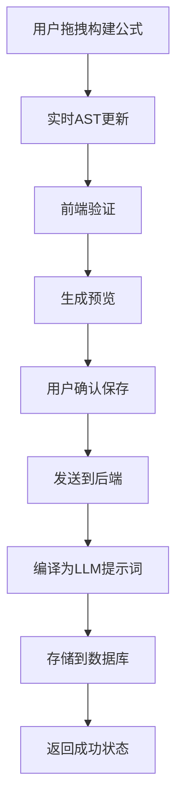

# Custom Formula Builder - 完整技术实现方案

## 📋 项目概述

### 核心价值
解决fintech AI最重要的痛点：财务指标计算标准化问题。让用户自定义指标计算逻辑，确保分析的准确性和一致性。

### 功能目标
- 可视化拖拽式公式构建器
- 基于现有financial fields的组件化设计
- 自动生成结构化LLM计算指令
- Excel风格的用户体验

---

## 🛠️ 技术栈选择

### 前端核心库

#### 1. 数学表达式解析
**选择：自建轻量级AST解析器 + math.js作为运算引擎**

**原因：**
- math.js功能强大但过重（~500kb），仅用于最终计算
- 现有库都不完全适配我们的业务需求
- 自建解析器可以完美控制AST结构，便于转录

**备选方案对比：**
```javascript
// math.js - 功能全面但过重
import { evaluate, parse } from 'mathjs'

// expression-parser - 轻量但功能有限
import Parser from 'expression-parser'

// 自建方案 - 完全可控
class FinancialFormulaParser {
  parse(expression: string): FormulaAST
  validate(ast: FormulaAST): ValidationResult
  compile(ast: FormulaAST): CompiledFormula
}
```

#### 2. 拖拽交互库
**选择：@dnd-kit/core**

**理由：**
- 现代化架构，10kb轻量级
- 无外部依赖，性能优秀
- 高度可定制，支持复杂交互
- 内置移动端支持和无障碍功能

**配置示例：**
```javascript
import {
  DndContext,
  DragOverlay,
  closestCenter,
  KeyboardSensor,
  PointerSensor,
  useSensor,
  useSensors,
} from '@dnd-kit/core'
```

#### 3. UI组件设计
**基于现有shadcn/ui + 自定义Canvas组件**

---

## 🏗️ 系统架构设计

### 1. 数据结构设计

```typescript
// 财务字段定义
interface FinancialField {
  id: string
  name: string
  category: 'income' | 'balance' | 'cashflow'
  aliases: string[]
  description: string
  unit: 'USD' | 'percentage' | 'ratio'
  dataSource: {
    endpoint: string
    field: string
  }
}

// 公式抽象语法树
interface FormulaAST {
  id: string
  type: 'operation' | 'field' | 'constant' | 'function'
  value: string | number
  children?: FormulaAST[]
  position?: { x: number; y: number }
}

// 自定义指标定义
interface CustomMetric {
  id: string
  name: string
  description: string
  category: string
  formula: FormulaAST
  prompt: string // 生成的LLM提示词
  createdBy: string
  createdAt: Date
  updatedAt: Date
  isPublic: boolean
}

// 计算步骤
interface CalculationStep {
  stepNumber: number
  description: string
  operation: string
  inputs: string[]
  output: string
  expression: string
}
```

### 2. 前端组件架构

```
📁 components/formula-builder/
├── 📄 FormulaBuilderPage.tsx          # 主页面
├── 📄 MetricsList.tsx                 # 指标列表管理
├── 📄 FormulaEditor.tsx               # 公式编辑器Dialog
├── 📁 canvas/
│   ├── 📄 FormulaCanvas.tsx           # 拖拽画布
│   ├── 📄 FormulaNode.tsx             # 公式节点组件
│   └── 📄 ConnectionLines.tsx         # 连接线组件
├── 📁 panels/
│   ├── 📄 FieldsPanel.tsx             # 字段选择面板
│   ├── 📄 OperatorsPanel.tsx          # 操作符面板
│   └── 📄 PreviewPanel.tsx            # 预览面板
└── 📁 utils/
    ├── 📄 formula-parser.ts           # AST解析器
    ├── 📄 formula-compiler.ts         # 公式编译器
    └── 📄 prompt-generator.ts         # LLM提示词生成
```

---

## 🔄 前后端联动设计

### 1. API设计

```typescript
// 指标CRUD操作
GET    /api/custom-metrics              # 获取用户指标列表
POST   /api/custom-metrics              # 创建新指标
PUT    /api/custom-metrics/:id          # 更新指标
DELETE /api/custom-metrics/:id          # 删除指标

// 公式相关操作
POST   /api/formula/validate            # 验证公式合法性
POST   /api/formula/compile             # 编译公式为提示词
POST   /api/formula/test                # 测试公式计算

// 字段数据
GET    /api/financial-fields            # 获取所有可用字段
GET    /api/financial-fields/search     # 搜索字段
```

### 2. 数据流设计



---

## 🗄️ 数据库设计

### 1. Convex Schema扩展

```typescript
// convex/schema.ts 新增表
export default defineSchema({
  // 现有表...
  
  // 自定义指标表
  customMetrics: defineTable({
    name: v.string(),
    description: v.string(),
    category: v.string(),
    formula: v.any(), // FormulaAST JSON
    prompt: v.string(), // 生成的LLM提示词
    userId: v.id("users"),
    isPublic: v.boolean(),
    createdAt: v.number(),
    updatedAt: v.number(),
  }).index("by_user", ["userId"])
    .index("by_category", ["category"])
    .index("by_public", ["isPublic"]),

  // 公式使用记录（用于分析和优化）
  formulaUsage: defineTable({
    metricId: v.id("customMetrics"),
    userId: v.id("users"),
    usedAt: v.number(),
    calculationTime: v.number(), // 计算耗时
    success: v.boolean(),
  }).index("by_metric", ["metricId"])
    .index("by_user", ["userId"]),
})
```

### 2. 数据库操作

```typescript
// convex/customMetrics.ts
export const create = mutation({
  args: {
    name: v.string(),
    description: v.string(),
    category: v.string(),
    formula: v.any(),
    prompt: v.string(),
  },
  handler: async (ctx, args) => {
    const identity = await ctx.auth.getUserIdentity()
    if (!identity) throw new Error("Not authenticated")

    const user = await ctx.db
      .query("users")
      .withIndex("by_clerk_user_id", (q) => q.eq("clerkUserId", identity.subject))
      .unique()

    if (!user) throw new Error("User not found")

    return await ctx.db.insert("customMetrics", {
      ...args,
      userId: user._id,
      isPublic: false,
      createdAt: Date.now(),
      updatedAt: Date.now(),
    })
  },
})
```

---

## 🔧 核心算法实现

### 1. AST解析器

```typescript
class FinancialFormulaParser {
  private tokens: Token[] = []
  private current = 0

  parse(expression: string): FormulaAST {
    this.tokens = this.tokenize(expression)
    this.current = 0
    return this.parseExpression()
  }

  private tokenize(expr: string): Token[] {
    const tokens: Token[] = []
    const patterns = {
      FIELD: /^[a-zA-Z_][a-zA-Z0-9_]*/,
      NUMBER: /^-?\d+(\.\d+)?/,
      OPERATOR: /^[+\-*/]/,
      LPAREN: /^\(/,
      RPAREN: /^\)/,
      WHITESPACE: /^\s+/,
    }
    
    // 词法分析实现...
    return tokens
  }

  private parseExpression(): FormulaAST {
    return this.parseAddition()
  }

  private parseAddition(): FormulaAST {
    let left = this.parseMultiplication()

    while (this.match('PLUS', 'MINUS')) {
      const operator = this.previous().value
      const right = this.parseMultiplication()
      left = {
        id: generateId(),
        type: 'operation',
        value: operator,
        children: [left, right]
      }
    }

    return left
  }

  // 更多解析方法...
}
```

### 2. 公式编译器（LLM提示词生成）

```typescript
class FormulaCompiler {
  compile(ast: FormulaAST, metricName: string): string {
    const steps = this.generateSteps(ast)
    const fields = this.extractFields(ast)
    
    return this.generatePrompt({
      metricName,
      description: `Calculate ${metricName} using the formula`,
      fields,
      steps,
      formula: this.astToString(ast)
    })
  }

  private generateSteps(ast: FormulaAST): CalculationStep[] {
    const steps: CalculationStep[] = []
    let stepCounter = 1

    const traverse = (node: FormulaAST, level = 0): string => {
      if (node.type === 'field') {
        return `${node.value}_value`
      }
      
      if (node.type === 'constant') {
        return node.value.toString()
      }

      if (node.type === 'operation' && node.children) {
        const leftResult = traverse(node.children[0], level + 1)
        const rightResult = traverse(node.children[1], level + 1)
        const resultVar = `step_${stepCounter}_result`

        steps.push({
          stepNumber: stepCounter++,
          description: `Execute ${node.value} operation`,
          operation: node.value as string,
          inputs: [leftResult, rightResult],
          output: resultVar,
          expression: `${leftResult} ${node.value} ${rightResult}`
        })

        return resultVar
      }

      return 'unknown'
    }

    traverse(ast)
    return steps
  }

  private generatePrompt(data: {
    metricName: string
    description: string
    fields: string[]
    steps: CalculationStep[]
    formula: string
  }): string {
    return `
# Calculate ${data.metricName}

## Description
${data.description}

## Required Data Fields
${data.fields.map(field => `- ${field}: Get from financial data`).join('\n')}

## Calculation Formula
\`${data.formula}\`

## Step-by-Step Calculation Instructions

${data.steps.map(step => `
### Step ${step.stepNumber}: ${step.description}
- Operation: ${step.expression}
- Calculate: ${step.output} = ${step.expression}
- Store result as: ${step.output}
`).join('\n')}

## Final Result
Return the final calculated value with appropriate formatting and units.

## Error Handling
- Check if all required fields have valid numeric values
- Handle division by zero scenarios
- Return clear error messages if calculation fails

IMPORTANT: Follow each step exactly as described. Do not skip steps or use alternative calculation methods.
    `.trim()
  }
}
```

---

## 📱 用户体验设计

### 1. 交互流程

```
用户流程：
1. 进入Custom Metrics页面 → 看到指标列表
2. 点击"New Metric" → 打开公式编辑器Dialog
3. 在左侧搜索和选择财务字段
4. 拖拽字段到画布中央
5. 添加运算符连接字段
6. 实时预览公式和计算结果
7. 保存指标 → 自动生成LLM提示词
8. 在AI对话中使用自定义指标
```

### 2. UI/UX关键点

```typescript
// 关键交互组件
const FormulaCanvas = () => {
  const [nodes, setNodes] = useState<FormulaNode[]>([])
  const [connections, setConnections] = useState<Connection[]>([])
  
  return (
    <DndContext onDragEnd={handleDragEnd}>
      <div className="formula-canvas">
        {nodes.map(node => (
          <FormulaNode
            key={node.id}
            data={node}
            onConnect={handleConnect}
            onDelete={handleDelete}
          />
        ))}
        <ConnectionLines connections={connections} />
      </div>
    </DndContext>
  )
}
```

---

## 🚀 实施计划

### Phase 1: 基础架构 (2周)
- [ ] 数据库Schema设计和迁移
- [ ] AST解析器核心算法实现
- [ ] 基础UI组件和页面结构

### Phase 2: 核心功能 (3周)  
- [ ] 拖拽式公式编辑器
- [ ] 字段搜索和选择功能
- [ ] 公式验证和预览

### Phase 3: 高级功能 (2周)
- [ ] LLM提示词生成引擎
- [ ] 复杂公式支持（分子分母、嵌套）
- [ ] 预设模板和导入导出

### Phase 4: 优化和测试 (1周)
- [ ] 性能优化和错误处理
- [ ] 用户体验优化
- [ ] 单元测试和集成测试

---

## 🧪 测试策略

### 1. 单元测试
```typescript
// 测试AST解析器
describe('FormulaParser', () => {
  test('should parse simple addition', () => {
    const parser = new FormulaParser()
    const ast = parser.parse('netIncome + revenue')
    expect(ast.type).toBe('operation')
    expect(ast.value).toBe('+')
  })

  test('should handle operator precedence', () => {
    const ast = parser.parse('revenue * 0.1 + expenses')
    // 验证AST结构...
  })
})
```

### 2. 集成测试
- 端到端公式构建流程测试
- LLM提示词生成准确性测试
- 拖拽交互功能测试

---

## 🔒 安全考虑

1. **公式执行安全**
   - 禁止执行任意JavaScript代码
   - 仅允许安全的数学运算
   - 输入验证和清理

2. **用户权限控制**
   - 用户只能修改自己的指标
   - 公开指标的访问控制
   - API权限验证

3. **数据验证**
   - 前后端双重验证
   - SQL注入防护
   - XSS攻击防护

---

## 📊 性能优化

1. **前端优化**
   - 虚拟化大列表渲染
   - AST计算结果缓存
   - 防抖处理用户输入

2. **后端优化**
   - 公式编译结果缓存
   - 数据库查询优化
   - API响应压缩

---

## 🔄 未来扩展

1. **公式模板市场**
   - 用户分享自定义指标
   - 行业标准模板库
   - 社区评分和评论

2. **高级计算功能**
   - 时间序列计算
   - 条件逻辑支持
   - 统计函数集成

3. **AI辅助构建**
   - 自然语言转公式
   - 智能推荐相关字段
   - 公式优化建议

---

这个实现方案提供了完整的技术栈选择、架构设计和实施路径，确保项目的可行性和可维护性。